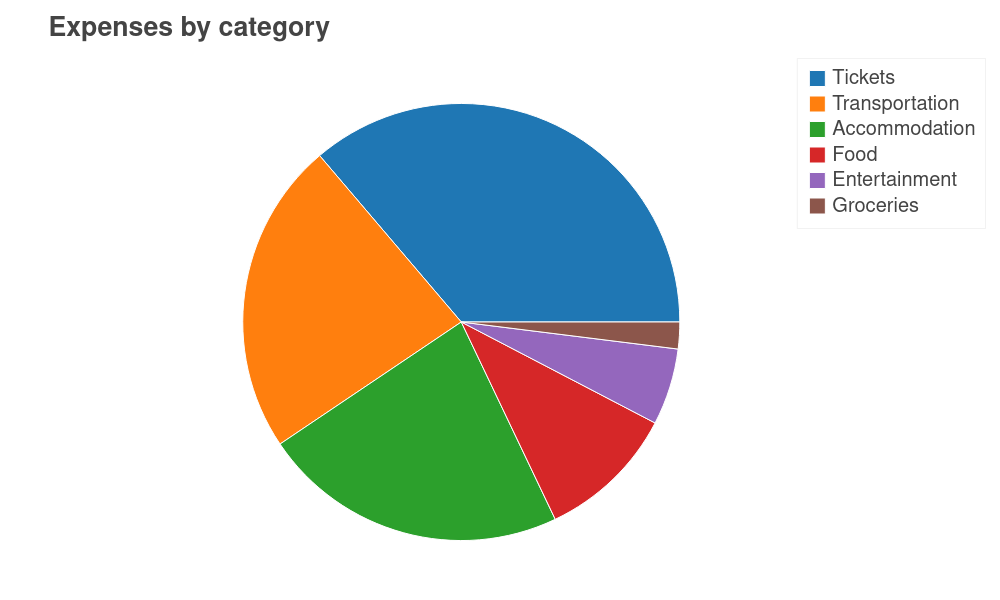

# SettleUpGraphs

Create beautiful graphs of your expenses in SettleUp

## Example graphs

## Usage

1. Clone this repository: `git clone https://github.com/BurningKarl/SettleUpGraphs.git && cd SettleUpGraphs`
1. Set up and activate your python environment: `pipenv install && pipenv shell`
1. Use email export from SettleUp and put the `transactions.csv` file into the current folder
1. Run `python main.py`
1. Open `SettleUpGraphs.html` with your web browser and view the generated graphs

*Note:* This tool makes use of the SettleUp categories, which is a paid feature at the moment. 
If you don't have this feature you can fill in your categories in the corresponding column in the CSV file and get the same result.

### More options

You can customize your output by using the commandline options:
* `-b bokeh` or `-b pgf` changes the backend.  
  While `bokeh`, the default backend, produces an HTML file with the graphs you can see above, 
  `pgf` produces a PDF file with the help of LaTeX ([example output](samples/SampleGraphs.pdf)). 
  You will need a LaTeX installation to use it, see https://matplotlib.org/tutorials/text/pgf.html.
* `-e` or `--emojis` disables translation of categories.  
  By default every category is translated from an emoji to its meaning. 
  This is especially important for the `pgf` backend, because LaTeX does not support emojis by default.
  If some of the emojis are not translated, you can either disable translation or add them to the correct 
  `emoji.{language}.yml` file in the translations folder.
* `-l LANGUAGE` sets the language for translation.  
  The script tries to guess your language based on your systems locale settings, but you can also set it manually.
  The country codes are `en` or `de` for example and correspond to the files in the translations folder.
  If your language is not supported consider adding it and opening a pull request.
  The project uses https://pypi.org/project/python-i18n/ as the translation framework.
* `-i INPUT_FILE` and `-o OUTPUT_FILE` changes the input and output files  
  The program expects the input to be a `transactions.csv` in the same folder as the script and 
  outputs to `SettleUpGraphs.html` or `SettleUpGraphs.pdf` (depending on the backend) in this folder.
  If you want to use a different input file or want to save the output to a different location use the options above.

## FAQ

* **How do I restrict the graphs to a subset of all expenses?**  
  Just remove the unecessary expenses from the CSV file but be sure to leave the header (first line) in otherwise the first expense will be ignored.
  
* **How do I generate other graphs / a subset of these graphs?**  
  The current graphs are hardcoded inside the `{backend}_graphs.py` files, you would need to adapt those to your needs.
  
* **How can I change the titles and category labels to be in my language**  
  You need to add the command line option `-l LANGUAGE`, where `LANGUAGE` is an abbreviated country code, 
  e.g. `en`, `de` or `fr`, and make sure that the corresponding translations can be found in 
  `titles.{language}.yml` and `emoji.{language}.yml` in the `translations` folder.
  
* **Some categories are displayed as "emoji.{some emoji}" while others are correctly translated**  
  The translations of the emojis can be found in `translations/emoji.{language}.yml`. 
  Edit the file corresponding to your language to add support for your custom emojis.

## Tools

* The visualization library [Bokeh](https://bokeh.org)
* The visualization library [Matplotlib](https://matplotlib.org) with the PGF backend
* The internationalization library [`python-i18n`](https://pypi.org/project/python-i18n/)
